# Test Evidence Report — real captured screenshots

> **Docs:** [Overview](../README.md) &middot; [HA Report](REPORT.md) &middot; [Test-Case Matrix](TEST-CASES.md) &middot; **Evidence** &middot; [Functional &amp; DB](FUNCTIONAL-AND-DATABASE-TESTS.md) &middot; [Decisions](DECISION.md) &middot; [Test Plan](TEST-PLAN.md) &middot; [pytest suite](../tests/README.md) &middot; [🌐 Report site](index.html)

This document backs every test area with **real, captured screenshots** of the live 3-node TigerGraph
4.1.4 HA cluster — terminal sessions and the Admin Portal UI — each paired with the test case it
proves, the observed result, and a link to the full command output.

All images are genuine screen captures (⌘⇧4) taken during a single end-to-end run against the live
cluster. Terminal-A commands were also recorded to a session log; every laptop command tees its full
output to `results/logs/`. Nothing here is rendered or reconstructed.

- **Screenshots:** [`../results/screenshots/real/`](../results/screenshots/real/)
- **Full command logs:** [`../results/logs/`](../results/logs/) (incl. `terminal_session_node.log` — the recorded node session)
- **Test-case detail & assertions:** [FUNCTIONAL-AND-DATABASE-TESTS.md](FUNCTIONAL-AND-DATABASE-TESTS.md) · **HA cases:** [REPORT.md](REPORT.md)

> **Terminal vs Browser** — 🖥️ = command-line (SSH into the node, or laptop REST calls) · 🌐 = Admin Portal UI.

---

## A. The system under test is a real 3-node HA cluster

### 🌐 Admin Portal — all services Online, replication factor 2
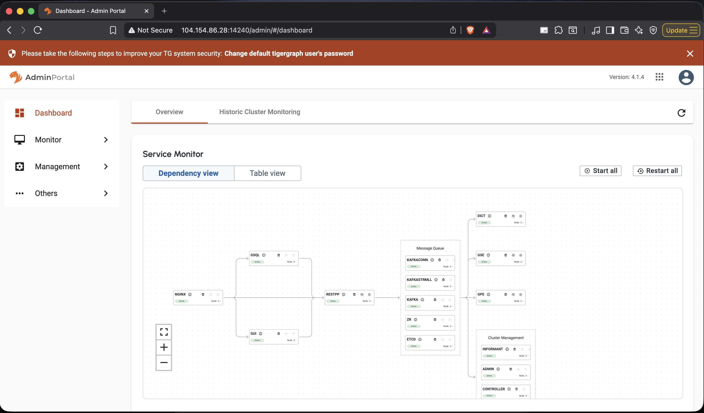
**Proves:** live TigerGraph **4.1.4** Admin Portal, every service **Online**. GPE and GSE show
**Node : 2** (data replicated across 2 of 3 nodes = **RF 2**); GSQL/RESTPP/ZK/ETCD show Node : 3.
**Result:** ✅ healthy HA cluster, RF=2 confirmed in the UI.

### 🌐 Admin Portal — 3 nodes Online
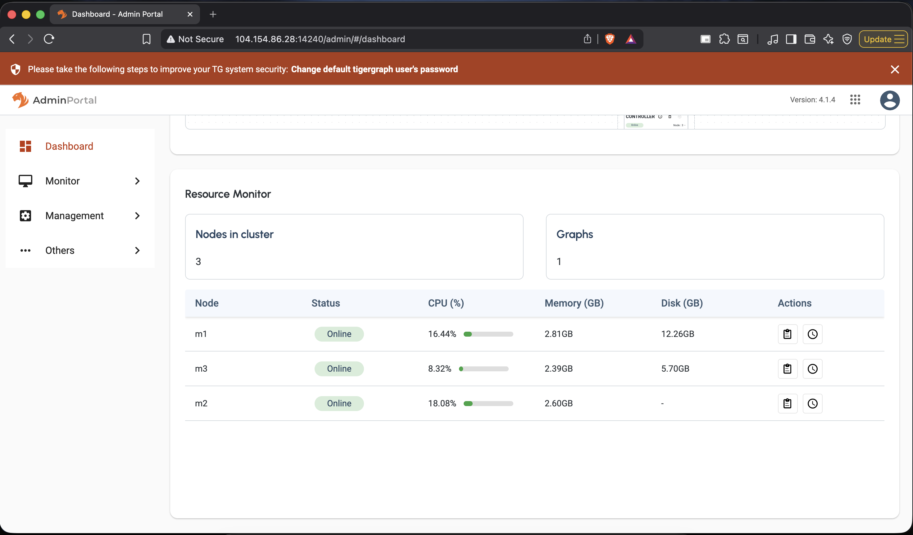
**Proves:** Resource Monitor — **m1, m2, m3 all Online** with live CPU/memory; "Nodes in cluster: 3".
**Result:** ✅ genuine 3-node cluster.

### 🖥️ `gadmin status -v` — every service Online
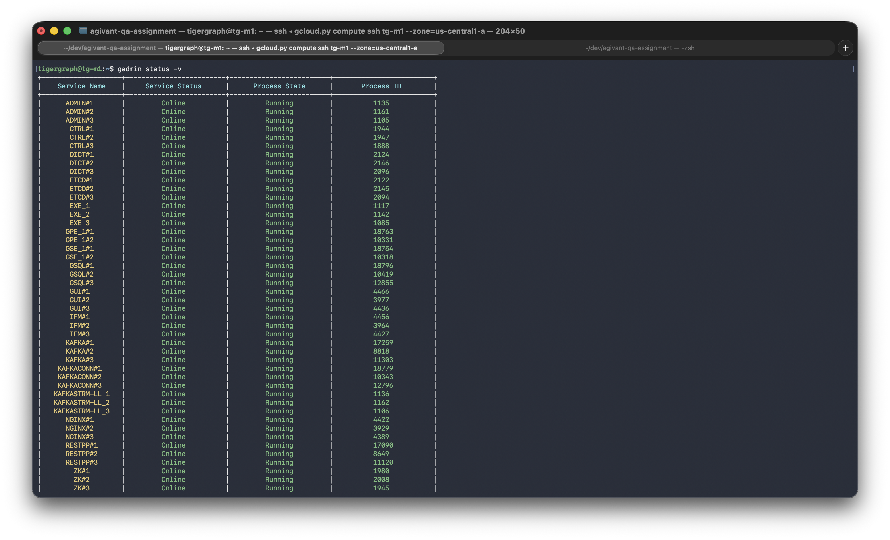
**Proves:** full service table (ADMIN, CTRL, DICT, ETCD, EXE, GPE_1#1/#2, GSE_1#1/#2, GSQL#1/2/3,
RESTPP#1/2/3, ZK, KAFKA…) all **Online / Running** across the 3 nodes.
**Result:** ✅ · **Log:** `results/logs/terminal_session_node.log`

### 🖥️ Topology (RF=2) + Enterprise license
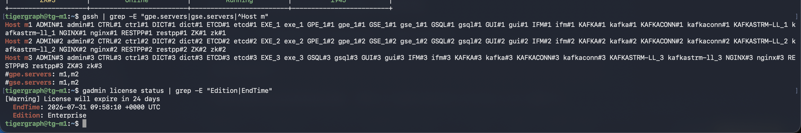
**Proves:** `gssh` shows **`#gpe.servers: m1,m2`** and **`#gse.servers: m1,m2`** — the data plane is
replicated on 2 of 3 nodes; m3 is coordination-only. License: **Edition: Enterprise** (valid EndTime).
**Result:** ✅ RF=2 topology + HA-capable license.

### 🖥️ Replica consistency — m1 == m2
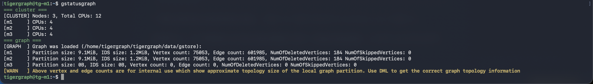
**Proves:** `gstatusgraph` — **m1 and m2 report identical** Vertex count (75,053) and Edge count
(601,985); m3 holds no data partition.
**Result:** ✅ the two data replicas are byte-for-byte consistent.

---

## B. Functional & Database testing (normal operation)

### 🖥️ CRUD lifecycle on the live REST API — FT1–FT3, FT7, DT7
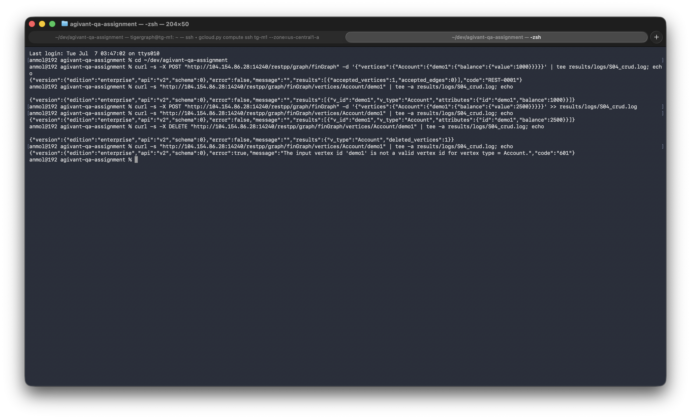
**Proves (manual, one command at a time):** CREATE → `accepted_vertices:1`; READ → `balance:1000`;
UPDATE-in-place → `balance:2500`; DELETE → `deleted_vertices:1`; final READ → clean error
*"input vertex id 'demo1' is not a valid vertex id"* (gone, not a crash).
**Result:** ✅ · **Log:** `results/logs/S04_crud.log`

### 🖥️ Functional + Database pytest suite — FT1–FT12 + DT1–DT7
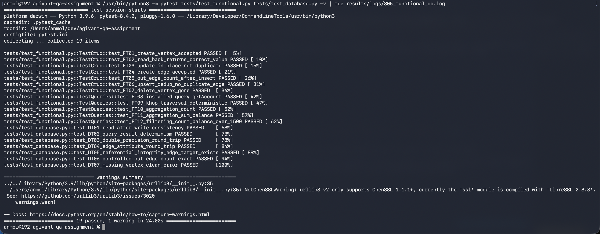
**Proves:** `pytest -v` — 19 named cases (`test_FT01_create_vertex_accepted` …
`test_DT07_missing_vertex_clean_error`) each **PASSED**, footer **`19 passed`**.
**Result:** ✅ 19/19 · **Log:** `results/logs/S05_functional_db.log` · **Suite:** [`tests/`](../tests/)

### 🖥️ Messy / larger-data pytest suite — MD1–MD12
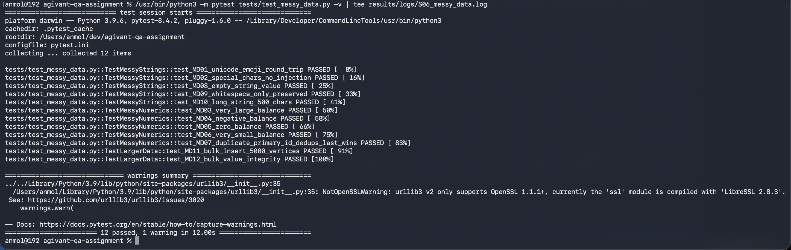
**Proves:** unicode+emoji round-trip, `<script>` no-injection, extreme numerics, duplicate-id dedup,
**bulk 5,000-vertex insert** — all **PASSED**, footer **`12 passed`**.
**Result:** ✅ 12/12 · **Log:** `results/logs/S06_messy_data.log`

---

## C. Resilience — behaviour under node failure & recovery

### 🖥️ Data consistency across a node failure + recovery — CR1–CR4
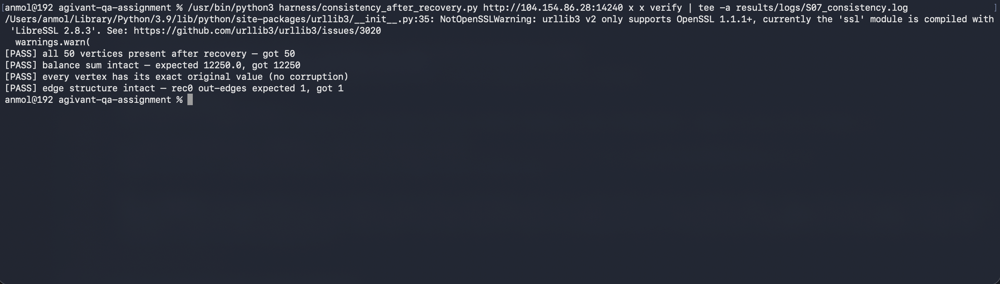
**Proves:** with a known 50-vertex fixture (balance sum 12,250), after **powering off data node m2**
and recovering it: all 50 vertices present, **sum intact (12,250)**, every value exact (no
corruption), edge structure intact — verified **both while m2 was down and after recovery**.
**Result:** ✅ 4/4 · **Log:** `results/logs/S07_consistency.log`

### 🖥️ Replicas identical again after the rejoin — CR4
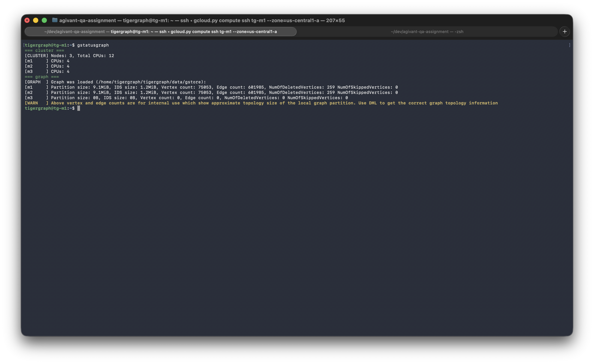
**Proves:** post-recovery `gstatusgraph` — m1 and m2 back to **identical** counts (75,053 / 601,985).
**Result:** ✅ no divergence after a full failure/recovery cycle.

### 🖥️ Backup create + list — BR1
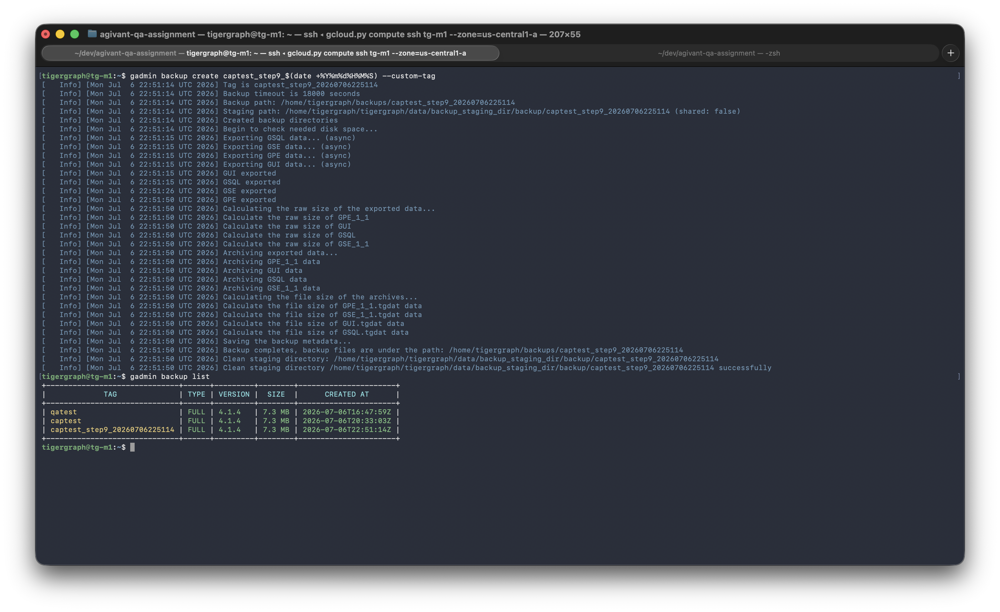
**Proves:** `gadmin backup create … --custom-tag` completes (exports GSQL/GSE/GPE/GUI, archives,
saves metadata), then `gadmin backup list` shows the FULL 4.1.4 backups.
**Result:** ✅ · **Log:** `results/logs/S08_backup.log`

### 🖥️ Restore reverts to point-in-time state — BR2–BR4
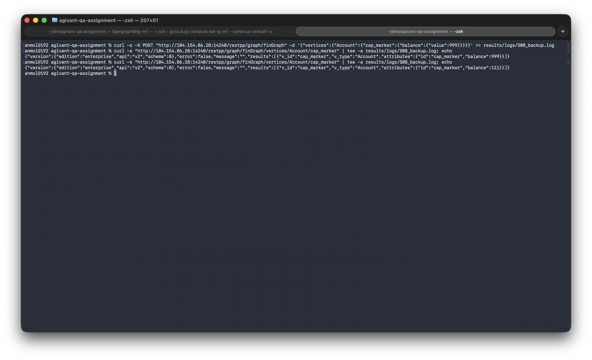
**Proves:** a marker changed to **999** after the backup; after `gadmin backup restore`, the same read
returns **111** — the exact pre-change (backup-time) value.
**Result:** ✅ point-in-time restore confirmed (999 → 111).

### 🖥️ Real log: GSQL leader failover — HA Case 2
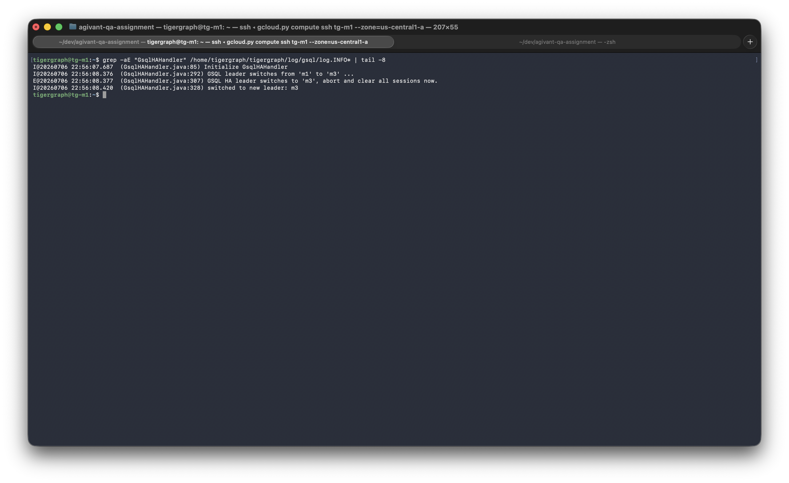
**Proves:** genuine `GsqlHAHandler` log lines — *"GSQL leader switches from 'm1' to 'm3' … abort and
clear all sessions now … switched to new leader: m3"*.
**Result:** ✅ control-plane leader failover observed in the real logs.

### 🖥️ Live degraded-mode block: INSTALL QUERY → pendingInstall — HA Case 3
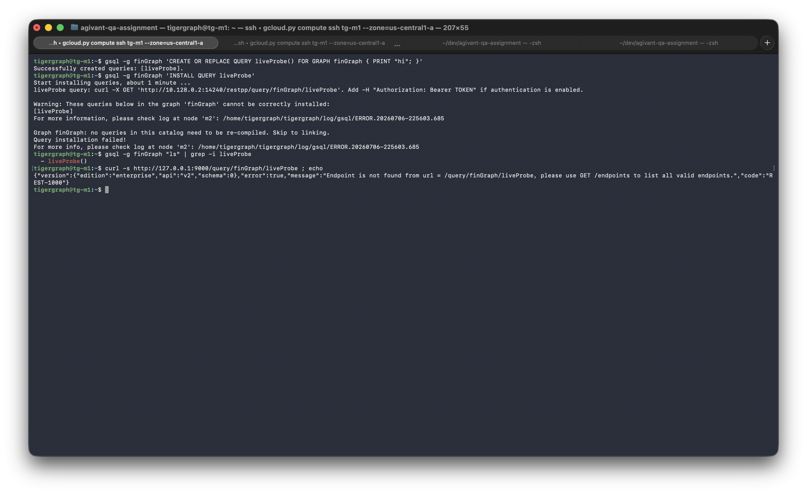
**Proves (live, with a node down):** `CREATE QUERY` succeeds, `INSTALL QUERY` prints a success-looking
message, **but** `gsql ls` shows the query only `(pendingInstall)` and the REST endpoint returns
**"Endpoint is not found"** — the "CLI reports success, verify the effect" finding, reproduced live.
**Result:** ✅ schema/DDL correctly blocked while the cluster is degraded.

### 🖥️ Live HA Case 1 — reads survive a data-node failure
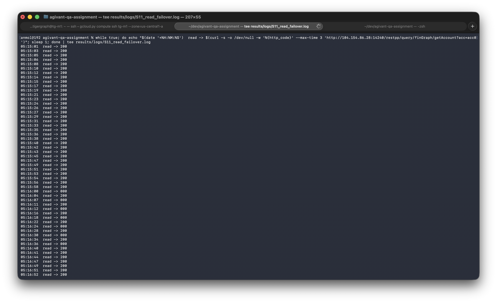
**Proves:** a 1/sec read probe: a run of `200`s → a **brief burst of `000`** as m2 is powered off and
the request reroutes → **steady `200`s again** with m2 fully down.
**Result:** ✅ reads self-heal across a data-node failure (brief, retry-maskable window).
**Log:** `results/logs/S11_read_failover.log`

### 🌐 The degraded cluster in the Admin Portal
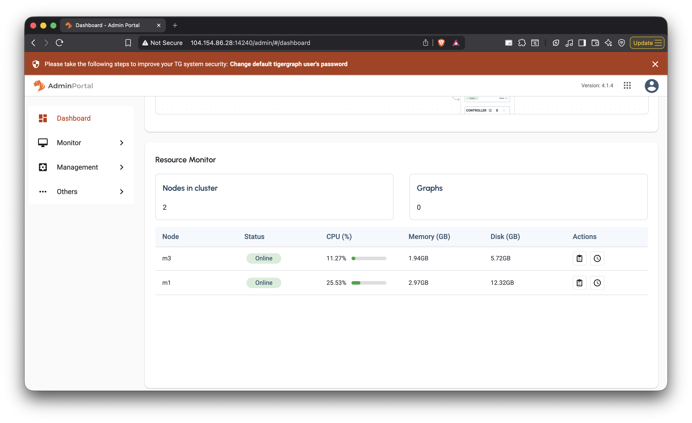
**Proves:** with m2 down, the portal Resource Monitor drops to **"Nodes in cluster: 2"** (m1 + m3
Online, m2 gone) — the failure is visible in the UI, not just the CLI.
**Result:** ✅ degraded state reflected in the portal.

### 🖥️ Live HA Case 4 — the quorum boundary (headline finding)
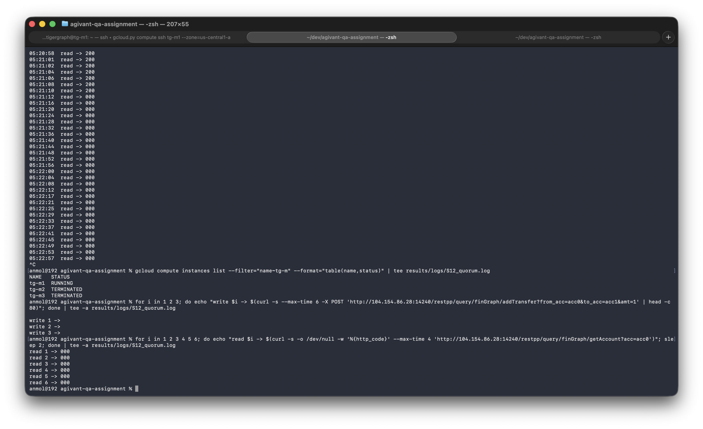
**Proves:** with **two nodes down** (m2 + m3 TERMINATED, only m1 up), even though m1 holds a complete
data replica: **writes fail** (empty/rejected) and **reads flap to `000`**. Effective fault
tolerance = **1 node**, set by the coordination quorum, not by data replication.
**Result:** ✅ quorum boundary demonstrated live · **Log:** `results/logs/S12_quorum.log`

---

## Coverage summary

| Area | Test cases | Evidence | Result |
|---|---|---|---|
| Cluster is real 3-node HA, RF=2 | — | P01, P02, S01, S02, S03 | ✅ |
| Functional (CRUD, queries, aggregation, filtering) | FT1–FT12 | S04, **S05 (19/19)** | ✅ |
| Database correctness (precision, determinism, integrity) | DT1–DT7 | **S05 (19/19)** | ✅ |
| Messy / larger data (unicode, injection, dedup, bulk 5k) | MD1–MD12 | **S06 (12/12)** | ✅ |
| Consistency after node failure + recovery | CR1–CR4 | S07, S07b | ✅ |
| Backup & restore (point-in-time) | BR1–BR4 | S08, S08b | ✅ |
| HA Case 1 — read failover | 1c | **S11 (live)**, S11b | ✅ |
| HA Case 2 — GSQL leader failover | 2 | S09 (real log) | ✅ |
| HA Case 3 — DDL blocked while degraded | 3 | **S10 (live)** | ✅ |
| HA Case 4 — quorum boundary | 4 | **S12 (live)** | ✅ |
| HA Cases 1a/1b, 5, 6 — measured | — | probe CSVs + charts in [`../results/`](../results/) | ✅ |

**45 checks of three kinds** — **31** automated `pytest` tests (FT/DT/MD), **8** destructive/manual
functional-database checks (CR consistency + BR backup/restore), and **6** HA/resilience scenarios —
all evidenced: 42 by the live screenshots and real logs above, the rest by committed probe CSVs and
charts. (They are kept distinct on purpose; only the 31 run automatically in CI.) Assertion detail is in
[FUNCTIONAL-AND-DATABASE-TESTS.md](FUNCTIONAL-AND-DATABASE-TESTS.md); HA analysis and MTTR are in
[REPORT.md](REPORT.md).
